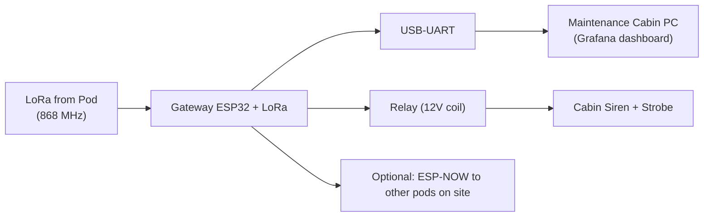
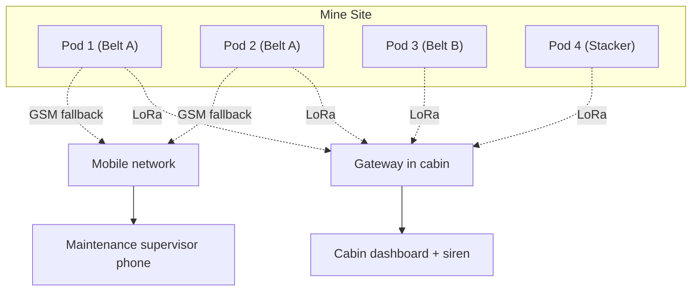

# Communication System Design

Two independent links from the belt pod:

1. **LoRa (SX1278 / RA-02)** — primary, free, long-range, low-power, works
   through rock. No SIM card, no monthly cost, no carrier.
2. **GSM (SIM800L)** — emergency fallback. Only used when LoRa is down or
   when an alarm is critical.

Both flow into a **Maintenance Station Gateway** (also ESP32 + LoRa), which
forwards to the cabin dashboard and sirens.

---

## 1. LoRa Primary Link — **SX1278 / RA-02 (433 / 868 / 915 MHz)**

### 1.1 Why LoRa (and not Wi-Fi / Zigbee / NB-IoT)

| Option | Cost | Range | Power | Works underground? | Verdict |
|---|---|---|---|---|---|
| **LoRa SX1278** | ₹400 | 2–5 km | 30 mA TX | yes (rock-loss ~12 dB) | **Winner** |
| Wi-Fi (ESP32) | ₹0 | 50 m | 200 mA | no (RF blocked by rock) | ✗ |
| Zigbee | ₹300 | 100 m | 30 mA | no | ✗ |
| NB-IoT | ₹600 module + SIM | OK | 200 mA | no (no signal) | ✗ |
| LoRa + GSM fallback | ₹800 | 2–5 km + cellular | mixed | yes | **Used** |

### 1.2 Module Spec — AI-Thinker RA-02

| Spec | Value |
|---|---|
| Chip | Semtech SX1278 |
| Frequency | 433 / 868 / 915 MHz (set by firmware, India = 868 MHz) |
| TX power | +20 dBm (100 mW) on PA_BOOST pin |
| Sensitivity | -148 dBm at SF12 / BW 125 kHz |
| Modulation | LoRa (CSS), FSK, OOK |
| Antenna | SMA female on module → external antenna via bulkhead |
| Interface | SPI (max 10 MHz) |

### 1.3 ESP32 Wiring (RA-02)

```
RA-02         ESP32
-------       ------
VCC     ──►  3.3 V  (separate LDO from ESP32, with 10 µF + 100 nF at pin)
GND     ──►  GND
SCK     ──►  GPIO18  (VSPI SCK, shared with display if any)
MISO    ──►  GPIO19  (VSPI MISO)
MOSI    ──►  GPIO23  (VSPI MOSI)
NSS/CS  ──►  GPIO5
RST     ──►  GPIO14
DIO0    ──►  GPIO26  (TX-done interrupt)
DIO1    ──►  GPIO33  (RX-done interrupt — optional)
```

> ⚠ Pin conflict with IR sensor on GPIO26 — IR sensor is moved to GPIO35
> (input-only ADC, OK for digital read with internal pull-up). Final map
> in [`WIRING_DIAGRAM.md`](WIRING_DIAGRAM.md).

### 1.4 Antenna

| Spec | Value |
|---|---|
| Type | 868 MHz λ/4 whip (3 cm rod) for test, λ/5 fiberglass collinear for production |
| Gain | 3 dBi (production), 2 dBi (test) |
| Connector | SMA male on antenna → N-type female bulkhead on pod wall |
| Placement | Outside the metal box; vertical; clear of belt frame by ≥ 30 cm |
| Coax | RG-58 (≤ 2 m) or LMR-200 (≤ 5 m) inside pod |
| Lightning | SMA gas-discharge arrestor at bulkhead |

For **underground** mines: run the antenna coax up to the **portal**
(surface) on a wooden batten, or use a **leaky feeder** running parallel
to the conveyor — LoRa at SF12 couples into the feeder inductively. This
extends coverage into kilometres of tunnel.

### 1.5 Link Budget (868 MHz, SF12, BW 125 kHz, +14 dBm TX)

```
TX power                       +14 dBm
TX antenna gain                +3 dBi
RX antenna gain                +3 dBi
Cable loss (5 m LMR-200)       -1.5 dB
Path loss (2 km free-space)    -99 dB  (868 MHz FSPL at 2 km)
Path loss (rock-wall, 30 m)    -12 dB
─────────────────────────────  ───────
RX power                       -92.5 dBm
RX sensitivity (SF12/BW125)    -137 dBm
─────────────────────────────  ───────
Link margin                    +44.5 dB   ← very robust

Even at 5 km in free space (FSPL = -106 dB), margin = +37.5 dB.
Even with two rock walls (-24 dB), margin = +18.5 dB at 1 km.
```

### 1.6 Air Protocol (hardware-level)

| Field | Size | Notes |
|---|---|---|
| Preamble | 8 symbols | standard LoRa preamble |
| Header | explicit | variable length, CRC on |
| Payload | ≤ 64 bytes | compressed JSON (CBOR if firmware team chooses) |
| Sync word | 0x12 | private network (not public LoRaWAN) |
| Spreading factor | SF9 (normal) → SF12 (alarm) | adaptive by firmware |
| Bandwidth | 125 kHz | India ISM-friendly |
| Coding rate | 4/5 | standard |
| TX interval | 30 s normal, 1 s alarm | firmware-side |

### 1.7 Frequency & Regulatory

- **India:** 865–867 MHz (8 × 125 kHz channels). Use 865.2 MHz as the
  default channel; firmware can cycle to avoid interference.
- **Max EIRP** in India: +14 dBm (25 mW). RA-02 + antenna gain fits under
  this if TX power is set to +11 dBm on the chip (compensate for 3 dBi
  antenna gain).
- For US/EU sites: 902–928 MHz or 863–870 MHz respectively.

---

## 2. GSM Fallback — **SIM800L**

### 2.1 Why SIM800L (and not SIM7000, BG96, NB-IoT)

| Option | Cost | Bands | Power | Notes |
|---|---|---|---|---|
| SIM800L | ₹350 | 2G quad | 250 mA TX | ubiquitous, cheap, voice-capable |
| SIM7000 LTE-CAT-M1 | ₹1500 | LTE-M | 200 mA | LTE not on all mines |
| BG95 NB-IoT | ₹1200 | NB-IoT | 200 mA | same issue |
| A7670E 4G | ₹1300 | 4G | 350 mA | needs 4G coverage |

**SIM800L wins on cost + power + availability of 2G in rural India.**

### 2.2 Module Spec

| Spec | Value |
|---|---|
| Bands | 850/900/1800/1900 MHz |
| TX power | class 4 (2 W) @ 900 MHz, class 1 (1 W) @ 1800 MHz |
| Voltage | 3.4 – 4.4 V (typically fed from 4.0 V via Schottky) |
| Peak current | 2 A bursts during TX (must have 100 µF + 470 µF bulk cap) |
| Interface | UART (default 115 200 baud) |
| SIM | Micro-SIM, hot-swappable |
| Antenna | SMA or u.FL on module |

### 2.3 ESP32 Wiring (SIM800L)

```
SIM800L       ESP32
-------       ------
VCC     ──►  4.0 V from battery via Schottky (MBR2045)
GND     ──►  GND
TXD     ──►  GPIO27   (SIM → ESP, software UART)
RXD     ──►  GPIO33   (ESP → SIM, software UART)
PWRKEY  ──►  GPIO15   (drive low 1 s to power on)
RESET   ──►  GPIO4    *(shared with HX711 SCK — move SCK to GPIO17)*
STATUS  ──►  GPIO13   *(shared with MQ heater — move heater to GPIO2)*
NET     ──►  not connected (use AT+CREG polling)
```

> ⚠ Resolved pin moves are in the final [`WIRING_DIAGRAM.md`](WIRING_DIAGRAM.md).

### 2.4 SIM800L Power Trick

The SIM800L needs 4.0 V, **not** 5 V. From the 12 V battery:
```
12 V ──► [LM2596 set to 4.0 V] ──► 470 µF bulk ──► SIM800L VCC
```
With a Schottky diode (MBR2045) in series to drop ~0.3 V if you want to
share a 4.3 V rail. **Never** power SIM800L from the 3.3 V rail.

### 2.5 When GSM Fires

Triggered by firmware under any of:
- 5 consecutive failed LoRa TX (no ACK from gateway)
- Critical alarm (belt fire, voltage collapse)
- Manual SMS command from maintenance cabin (`STATUS?`)
- Daily "I'm alive" SMS at noon (off by default, configurable)

SMS format (firmware-side, but here's the hardware budget):

```
ALARM:BELT-FIRE
POD:1
TEMP:84C
RPM:0
VIB:8.1g
BAT:11.8V
LAT:23.4567  *(only if GPS module added, see v2)*
```

---

## 3. Maintenance Station Gateway

A second, indoor ESP32 + RA-02 + ESP32 gateway is installed in the
maintenance cabin. It listens for LoRa packets and forwards them to:

| Forwarding path | Hardware |
|---|---|
| Local dashboard | ESP32 gateway + USB → laptop/PC running Grafana + Node-RED |
| Cabin siren / beacon | Relay on ESP32 gateway GPIO → 12 V strobe + 110 dB siren |
| Internet (optional) | If 4G router exists, gateway posts to MQTT broker |

### 3.1 Gateway Block Diagram



### 3.2 Gateway Antenna Placement

- Indoor, near a window facing the belt.
- Or **external**: an outdoor N-type whip on a pole 3 m above the cabin,
  with coax back into the cabin through a wall gland.

---

## 4. Multi-Pod Topology (full site)



---

## 5. Range Extension Strategies (for very long / very deep mines)

| Strategy | When | Hardware addition |
|---|---|---|
| **LoRa repeater pod** | Belt > 2 km from cabin | One extra ESP32 + RA-02 in a sealed box, mains- or solar-powered, halfway |
| **External antenna on portal** | Underground mine | Route antenna coax up to surface, place λ/4 whip outside portal |
| **Leaky feeder** | Long straight tunnel | Pre-existing leaky feeder (used by miners' comms) — couple LoRa inductively with a few turns of wire |
| **Higher-gain antenna** | Cabin far from pit | 6 dBi Yagi at gateway, pointed at pit |

---

## 6. Reliability of the Link

| Threat | Mitigation |
|---|---|
| Multi-path fading inside pit | LoRa's high SF gives processing gain; frequency hopping in firmware |
| Lightning on mast antenna | Gas-discharge arrestor at bulkhead; grounded bulkhead plate |
| RF interference from VFD | Ferrite CM choke on all power cables entering pod |
| GSM outage | LoRa is primary; GSM is only fallback |
| Pod TX failure (firmware hang) | ESP32 watchdog; if LoRa silent for 5 min, gateway raises cabin alarm |

---

## 7. Bill of Materials (this section only)

| Qty | Part | Approx price (INR) |
|---|---|---|
| 1 | AI-Thinker RA-02 LoRa module (868 MHz) | ₹400 |
| 1 | 868 MHz λ/4 whip antenna (test) | ₹150 |
| 1 | 868 MHz 3 dBi fiberglass collinear (production) | ₹450 |
| 1 | SMA-N bulkhead + lightning arrestor | ₹350 |
| 1 | SIM800L module (with SIM holder) | ₹350 |
| 1 | SIM card (Airtel / Jio — 1-yr validity, low data) | ₹200 |
| 1 | LM2596 set to 4.0 V (for SIM800L) | ₹80 |
| 1 | MBR2045 Schottky diode | ₹20 |
| 2 | 470 µF 16 V electrolytic (SIM800L bulk) | ₹20 |

---

**Next file:** [`ENCLOSURE_DESIGN.md`](ENCLOSURE_DESIGN.md).