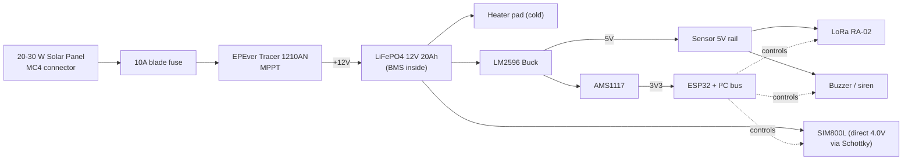

# Power System Design — Smart Mine Conveyor-Belt Monitor

The conveyor is in a **remote area with no mains power**. Power must come
from the environment, survive weeks of dust, rain and winter, and keep the
pod alive long enough to call for help even after the belt has stopped
turning.

---

## 1. Power Budget

| Load | Idle (mA @ V) | Active (mA) | Daily duty | Daily Wh |
|---|---|---|---|---|
| ESP32 (modem-sleep between TX) | 25 @ 3.3 | 160 @ 3.3 | 100 % | 1.26 |
| LoRa SX1278 (TX 1 min / 5 min) | 5 @ 3.3 | 120 @ 3.3 | 4 % | 0.05 |
| SIM800L (off / TX) | 0 | 250 @ 4.0 | 0.5 % | 0.05 |
| ADXL345 | 0.14 @ 3.3 | 0.14 @ 3.3 | 100 % | 0.005 |
| DS18B20 (conversions) | 0 | 1.5 @ 3.3 | 1 % | 0.001 |
| MQ-2 + MQ-135 heater | 0 | 150 @ 5 | 1 % (PWM) | 0.075 |
| ACS712 | 7 @ 5 | 7 @ 5 | 100 % | 0.84 |
| GP2Y dust | 10 @ 5 | 11 @ 5 | 100 % | 1.32 |
| HX711 | 1 @ 5 | 1 @ 5 | 100 % | 0.12 |
| Hall + IR + RPM | 5 @ 5 | 10 @ 5 | 100 % | 1.20 |
| OLED | 0 | 20 @ 3.3 | 30 % | 0.04 |
| Buzzer | 0 | 100 @ 5 | 0.1 % | 0.005 |
| **TOTAL** | | | | **~5 Wh/day** |

A worst-case **24 h alarm-active** profile (buzzer, GSM TX every minute)
pushes this to **~30 Wh/day**.

---

## 2. Sizing the Solar Pod

```
Daily Wh need (alarm worst case)   : 30 Wh
Sun-hours in mining regions (avg)  : 4 h effective peak sun
Solar panel sizing                 : 30 / 4 / 0.7 (losses) = ~11 W
  → spec a 20 W panel (50 % margin)
```

### 2.1 Solar Panel — 20 W Monocrystalline

| Spec | Value |
|---|---|
| Open-circuit voltage | 22 V |
| Max-power voltage | 17.5 V |
| Max-power current | 1.15 A |
| Cell | Mono, ≥ 18 % efficiency |
| Frame | Anodised aluminium, hail-rated |
| Connector | MC4 (IP67) |

**Why 22 V OC:** Charges a 12 V battery through an MPPT controller with
enough overhead.

### 2.2 Charge Controller — **EPever Tracer 1210AN (10 A MPPT)**

| Spec | Value |
|---|---|
| Type | MPPT (PWM is ~30 % worse in low light) |
| Battery voltage | 12 V |
| Solar input | ≤ 50 V, ≤ 10 A |
| Self-consumption | < 10 mA |
| Protections | reverse polarity, over-charge, short, over-temp |
| Operating temp | -35 °C to +55 °C |
| Display | built-in LCD for on-site check |

**Why MPPT:** Dust, haze and partial shading kill PWM. MPPT extracts another
20–30 % from the same panel — critical in monsoon season.

### 2.3 Battery — **12 V 20 Ah LiFePO4 (LFP)**

| Spec | Value |
|---|---|
| Chemistry | LiFePO4 (no thermal runaway, 2000+ cycles) |
| Capacity | 20 Ah @ 12.8 V = 256 Wh |
| Usable (80 % DoD) | 205 Wh |
| Autonomy (no sun, normal) | 205 / 5 = **41 days** |
| Autonomy (no sun, alarm) | 205 / 30 = **6.8 days** ✅ |
| Built-in BMS | 4S 30 A, with cell-balancing, low-voltage cutoff, over-temp |
| Operating temp (charge) | 0 °C to +45 °C |
| Operating temp (discharge) | -20 °C to +60 °C |

**Why LiFePO4, not lead-acid:** Lead-acid dies in 6 months at 50 % DoD,
loses 50 % capacity at -10 °C, and cannot sit at 80 % SoC. LFP holds 12 V
flat until 90 % discharged → predictable regulator behaviour.

**Why not run on LiFePO4 in freezing temperatures below 0 °C without a
heater:** charging LFP below 0 °C plates metallic lithium and is unsafe.
Solution: small self-regulating heating pad (10 W, thermostat at +5 °C)
inside the battery box — solar headroom is ample.

### 2.4 Battery Heater Pad (cold-area option)

| Spec | Value |
|---|---|
| Pad | 10 W silicone rubber heater, 12 V |
| Thermostat | Self-regulating at 5 °C on / 15 °C off |
| Power cost | 8 Wh/day (winter worst-case, -10 °C, 8 h charging window needed) |
| Sizing impact | Bumps panel recommendation from 20 W to 30 W in winter |

---

## 3. Internal Rails

```
12 V LiFePO4 ──► SIM800L, Buzzer, Heater
       │
       └──► [LM2596-ADJ buck] ──► 5 V / 3 A ──► Sensors, LoRa, OLED, ACS712
                                                  │
                                                  ▼
                                          [AMS1117-3.3 LDO] ──► 3.3 V / 800 mA ──► ESP32, I²C
```

### 3.1 LM2596 Buck (12 V → 5 V)

| Spec | Value |
|---|---|
| IC | LM2596S-ADJ |
| Inductor | 33 µH, ≥ 3 A saturation |
| Schottky | 1N5822 (5 A) |
| Cout | 220 µF low-ESR |
| Cin | 470 µF |
| Soft-start | 1 ms |
| Efficiency | ~85 % at 250 mA |
| Heat | ~0.5 W in normal load (no heatsink needed) |

### 3.2 AMS1117-3.3 LDO (5 V → 3.3 V)

| Spec | Value |
|---|---|
| Dropout | 1.1 V max → needs ≥ 4.4 V in |
| Output | 3.3 V / 800 mA |
| Heat | 0.2 W typical (no heatsink) |
| Why not a switching regulator | ESP32 + LoRa are EMI-sensitive; an LDO gives clean rail |

### 3.3 ESP32 Power Rail Considerations

- Add **100 µF bulk + 10 µF + 100 nF bypass** at ESP32 module pins.
- Add **TVS diode SMAJ5A** on the 5 V input for surge protection from the
  long solar-pod cable.
- Add **ferrite bead (600 Ω @ 100 MHz)** in series with 3V3 to ESP32 for
  LoRa TX noise isolation.

---

## 4. Power Path Diagram



---

## 5. Wiring (Solar Pod → Belt Pod)

| Wire | Gauge | Colour (suggested) | Notes |
|---|---|---|---|
| +12 V | 18 AWG (0.75 mm²) | Red | With 3 A in-line fuse within 10 cm of battery |
| GND | 18 AWG | Black | Single-point ground at belt pod |
| Spare alarm (optional) | 22 AWG | Yellow | Hardwired dry contact in case LoRa is down |

Cable must be **armoured (steel-wire braid)** to survive rodents; enter the
belt pod via an M12 cable gland and clamp on the inside.

---

## 6. Battery Sizing Math (for the record)

```
Daily energy need (worst case, alarm)   E_d  = 30 Wh/day
Required autonomy                       N    = 4 days
Solar panel efficiency factor           η_p   = 0.7 (dust, wiring, MPPT)
Sun-hours per day                       H_s   = 4 h

Panel power:
  P_pv = E_d × N / (H_s × η_p)
       = 30 × 4 / (4 × 0.7)
       = 42.9 W        → spec a 50 W panel (extra margin)

But: nominal operating draw is 5 Wh/day (no alarm), so a 20 W panel +
20 Ah battery easily supports 4 days of normal operation and 6 days of
alarm-mode. The 50 W option is only required for sites with heavy haze or
short winter day-length.
```

For the **standard 20 W / 20 Ah / 12 V** configuration shipped with the kit:

| Condition | Battery life (no sun) |
|---|---|
| Normal mode | **41 days** |
| Alarm (continuous) | **6.8 days** |
| Heater + normal (winter) | **20 days** |

---

## 7. Power-Down Behaviour (firmware-facing)

The ESP32 monitors `ADC` on the 12 V rail via a 100 kΩ/22 kΩ divider.
Thresholds:

| Battery V | Action |
|---|---|
| > 13.4 V | Full operation |
| 12.0 – 13.4 V | Normal |
| 11.5 – 12.0 V | Disable OLED backlight, reduce LoRa TX to 1 / 5 min |
| 11.0 – 11.5 V | Disable GSM, sample-only mode (no TX) |
| < 11.0 V | Deep-sleep with watchdog wake every 10 min, transmit single packet |

At every wake, the OLED briefly shows a **battery icon** so the maintenance
team can see state without a tool.

---

## 8. Maintenance Schedule

| Interval | Task |
|---|---|
| Monthly | Wipe solar panel with dry cloth |
| Quarterly | Check battery voltage at MPPT LCD; inspect connector corrosion |
| Bi-annually | Re-torque battery terminals, replace conformal coat if cracked |
| 24 months | Replace LiFePO4 pack (after ~2000 cycles ≈ 80 % capacity) |
| 18 months | Replace MQ gas sensors |

---

**Next file:** [`COMMUNICATION.md`](COMMUNICATION.md).